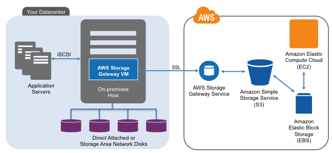
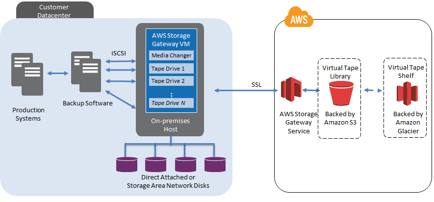

# AWS Storage Gateway Facts

## How it works

The AWS Storage Gateway supports three configurations:

1. Gateway-Cached Volumes: Store your primary data in Amazon S3, and retain frequently accessed data locally. 
**Why use it?** to provide substantial cost savings on primary storage, minimize the need to scale your storage on-premises, while retaining low-latency access to your frequently accessed data.

2. Gateway-Stored Volumes: In the event you need low-latency access to your entire data set, you can configure your on-premises data gateway to store your primary data locally, and asynchronously back up point-in-time snapshots of this data to Amazon S3. 
**Why use it?** to provide durable and inexpensive off-site backups that you can recover locally or from Amazon EC2 if, for example, you need replacement capacity for disaster recovery.

3. Gateway-Virtual Tape Library (Gateway-VTL): With Gateway-VTL you can have a limitless collection of virtual tapes. Each virtual tape can be stored in a [Virtual Tape Library](http://en.wikipedia.org/wiki/Virtual_tape_library) backed by Amazon S3 or a Virtual Tape Shelf backed by Amazon Glacier. The Virtual Tape Library exposes an industry standard [iSCSI](http://en.wikipedia.org/wiki/ISCSI) interface which provides your backup application with on-line access to the virtual tapes.
**Why use it?** to provide low-cost reliable backup.

## Architecture overview

The following diagram provides an overview of the AWS Storage Gateway deployment:

The following diagram provides an overview of the Gateway-VTL deployment:

## Benefits

- Secure (Data tranfer over SSL, encrypted by AES 256 in S3/Glacier)
- Durably backed by Amazon S3 and Amazon Glacier
- Compatible (Standard [iSCSI](http://en.wikipedia.org/wiki/ISCSI) interface)
- Cost-Effective
- Designed for use with other Amazon Web Services
- Optimized for Network Efficiency

## Common Use Cases

- Backup
- Disaster Recovery and Resilience
- Corporate File Sharing
- Data Mirroring to Cloud-Based Compute Resources
- Magnetic Tape Replacement for Archiving and Long-Term Backup (For Gateway-VTL)

## Pricing - Using Tokyo region as example

Gateway Pricing: $119.00 per activated virtual gateway appliance / month
Storage Pricing: [See here for details](http://aws.amazon.com/storagegateway/pricing/)

## How to deploy Storage Gateway VM

You can choose to run AWS Storage Gateway either on-premises, as a virtual machine (VM) appliance, or in AWS, as an Amazon EC2 instance. You can deploy your gateway on a host in your on-premises data center. AWS Storage Gateway supports the hypervisors VMware ESXi Hypervisor and Microsoft Hyper-V 2008 R2.

### Deploy on AWS EC2

Yes. It is possible to deploy Storage Gateway on AWS EC2. See here for details: [AWS Storage Gateway Announces Gateway for Amazon EC2](http://aws.amazon.com/about-aws/whats-new/2013/01/15/aws-storage-gateway-announces-gateway-for-amazon-ec2/).