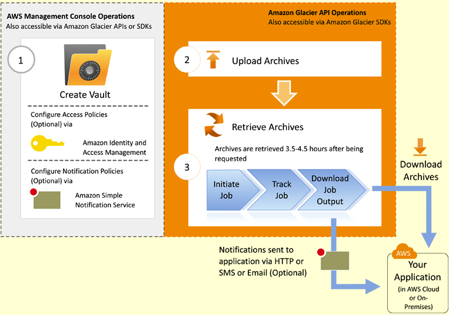

# AWS Glacier Facts

Q: What is Amazon Glacier?
A: Extremely low-cost storage service that provides secure, durable, and flexible storage for data backup and archival.

Q: Price model?
A: Per GB used, Per Request, and Data Transfer
   Data Retrival is free up to 5% of data stored for free each month.
   [More Info](http://aws.amazon.com/glacier/pricing/)

## Reliability

Q: How durable is Amazon Glacier?
A: Amazon Glacier is designed to provide average annual durability of 99.999999999% for an archive.

